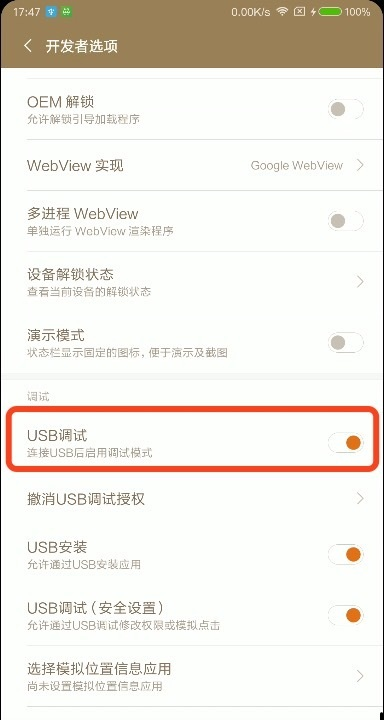
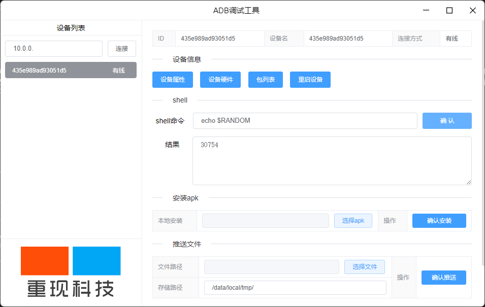

目录

- [reappear-adb - 重现科技](#intro)
  - [技术栈](#stack)
  - [要求](#require)
  - [开源地址](#opensource)
  - [微信交流群](#wechatgroup)
  - [项目外包](#project)
  - [页面预览](#preview)
    - [首页](#preview-index)
    - [初始化](#dev-init)
  - [License](#license)
  - [鸣谢](#thanks)

<a name="intro"></a>

# 🐼 reappear-adb - 重现科技

`reappear-adb` - 重现科技，由 深圳市重现科技有限公司( https://www.szcxkj.com/ ) 使用 Electron,Node 开发来驱动来自不同制造商的大量 Android 设备，支持无线和有线连接，支持大多数adb命令行工具的功能（包括推送/拉取文件、安装 APK 和处理日志），以及一些附加功能，例如能够生成触摸/按键事件和截屏。对 Android 设备进行调试管理，适用于生产测试，可以相当有信心地说它很可能也适用于您的设备。😜 给项目点点 Star 吧，这对我们真的很重要！

<a name="stack"></a>

## 🐰 技术栈

- Node
- Vue.js
- Electron

<a name="require"></a>

## 🌞 要求

1. `Android 5.0`以上

2. 打开USB调试

   在 `开发人员选项` 打开 `USB调试`，USB连接手机
   

3. 安装好`ADB` ，并配置环境变量。

   [Windows](https://dl.google.com/android/repository/platform-tools-latest-windows.zip)
   [Mac OS](https://dl.google.com/android/repository/platform-tools-latest-darwin.zip)
   [Linux](https://dl.google.com/android/repository/platform-tools-latest-linux.zip)

   在任何路径下打开命令行，键入 `ADB` 有反馈。

<a name="opensource"></a>

## 开源地址

- Github - https://github.com/reappear-technology/reappear-adb.git
- Gitee - https://gitee.com/reappear_open/reappear-adb.git

<a name="wechatgroup"></a>

## 🐯 微信交流群

重现科技微信交流群，请添加`阿杰杰`的微信，备注`重现科技加群`，以便进群。

**微信二维码**


<a name="project"></a>

## 🤝 项目外包

我们也是接外包滴，如果你有项目想要外包，可以微信联系【**rjwanxiang**】或添加扫码。

团队包含专业的项目经理、架构师、前端工程师、后端工程师、测试工程师、运维工程师，UI设计师，可以提供全流程的外包服务。

项目可以是商城、SCRM 系统、OA 系统、物流系统、ERP 系统、CMS 系统、HIS 系统、支付系统、直播、物联网、IM 聊天、微信公众号、微信小程序等等。

<a name="preview"></a>

## 🐨 页面预览

> 点击放大预览

<br/>

<a name="preview-index"></a>

### ⭐ 首页



<a name="dev-init"></a>

### 🚀 初始化

```bash
# 切换到web目录
cd reappear-adb

# 安装依赖
npm install or yarn install

# 运行前端
npm run dev
```

<a name="license"></a>

## 😎 License

开源版本基于 [Apache License 2.0](./LICENSE) 协议发布。

<a name="thanks"></a>

## 🙂 鸣谢

感谢各开源项目为重现科技的开发奠定了基础。如果遇到问题或有任何建议，与我们联系！
